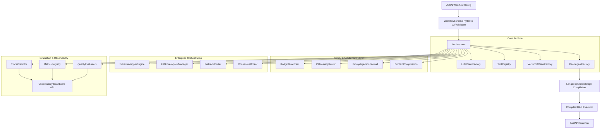

# AgenticAI SDK — Implementation Plan

## Architecture Overview (v0.2.0)



---

## Package Layout (v0.2.0)

```
AgenticAI_SDK/
├── pyproject.toml
├── main.py                          # FastAPI entrypoint
├── README.md
├── example_workflow.json            # v2 Sample workflow config
├── agenticai_sdk/
│   ├── __init__.py                  # version = "0.2.0"
│   ├── exceptions.py                # Domain exceptions (expanded)
│   │
│   ├── schemas/                     # Domain 1: Pydantic V2 models
│   │   ├── middleware_config.py     # NEW: Budget/PII/Firewall/Compression
│   │   ├── agent_node.py            # Updated with fallback/consensus/middleware
│   │   └── workflow.py              # Updated WorkflowSchema
│   │
│   ├── middleware/                  # Domain 6: Execution Safety (NEW)
│   │   ├── base.py                  # Middleware Pipeline Base
│   │   ├── budget_guardrails.py     # Token/Cost/Loop limits
│   │   ├── pii_masking.py           # Reversible PII vault
│   │   ├── prompt_injection_firewall.py
│   │   └── context_compression.py
│   │
│   ├── orchestration/               # Domain 7: Enterprise Coordination (NEW)
│   │   ├── schema_mapper.py         # Fuzzy JSON normalization
│   │   ├── hitl_breakpoints.py      # Slack/Teams state persistence
│   │   ├── fallback_router.py       # LLM failover
│   │   └── consensus_broker.py      # Multi-instance agreement
│   │
│   ├── evaluation/                  # Domain 8: Observability Suite (NEW)
│   │   ├── trace_collector.py       # Distributed span tracing
│   │   ├── metrics.py               # Prometheus metrics registry
│   │   ├── evaluators.py            # Relevance/Coherence/Groundedness
│   │   └── dashboard.py             # Observability API endpoints
│   │
│   ├── runtime/                     # Domain 4: Executive runtime
│   │   └── orchestrator.py          # Updated macro-execution engine
│   │
│   └── state/                       # Workflow state definition
│       └── workflow_state.py        # Updated with metadata + trace_id
```

---

## Domain Breakdown

### Domain 6: Middleware & Safety
- **Budget Guardrails**: Real-time token/cost estimation and loop iteration timeouts.
- **PII Masking**: Pattern-based detection with reversible vault for safe write-back.
- **Injection Firewall**: Dual-layer (regex + semantic) detection of adversarial prompts.
- **Context Compression**: Token-aware truncation and summarization strategies.

### Domain 7: Enterprise Orchestration
- **Schema Mapper**: Fuzzy-matching and normalization of dynamic API payloads.
- **HITL Breakpoints**: Execution freezing with Slack/Teams webhook notifications.
- **Fallback Router**: Non-blocking model swapping on provider failure.
- **Consensus Broker**: Majority-rule agreement across parallel agent instances.
- **Hierarchical Delegation**: Manager-worker patterns with sub-agent tool injection.

### Domain 8: Evaluation & Observability
- **Distributed Tracing**: Hierarchical span trees for every workflow execution.
- **Metrics Registry**: Thread-safe latency, token, and cost aggregation.
- **Quality Evaluators**: NLP metrics for response relevance and groundedness.
- **Dashboard API**: FastAPI endpoints for retrieving traces and metrics.

---

## Build Order (v0.2.0 Update)

| Phase | Files | Description |
|-------|-------|-------------|
| 1 | `exceptions.py`, `schemas/middleware_config.py` | Safety foundations |
| 2 | `middleware/*` | Implementation of the 4 safety layers |
| 3 | `orchestration/*` | Coordination engines (Fallback, Consensus, HITL) |
| 4 | `evaluation/*` | Observability core + Quality evaluators |
| 5 | `runtime/orchestrator.py` | Integration into the compilation loop |
| 6 | `gateway/app.py`, `gateway/routes.py` | Dashboard registration + state initialization |
| 7 | `tests/test_middleware.py` etc | Comprehensive 50-test validation suite |
| 8 | `README.md`, `example_workflow.json` | Documentation & V2 demonstration |
