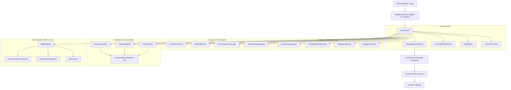

# AgenticAI SDK — Implementation Plan

## Architecture Overview (v0.3.0)



---

## Package Layout (v0.3.0)

```
AgenticAI_SDK/
├── pyproject.toml
├── main.py                          # FastAPI entrypoint
├── README.md
├── example_workflow.json            # v2 Research & Report demo (Fallback + Consensus)
├── agenticai_sdk/
│   ├── __init__.py                  # version = "0.3.0"
│   ├── exceptions.py                # Domain exceptions (expanded)
│   │
│   ├── schemas/                     # Domain 1: Pydantic V2 models
│   │   ├── middleware_config.py     # Budget/PII/Firewall/Compression
│   │   ├── agent_node.py            # Updated with fallback/consensus/middleware
│   │   └── workflow.py              # Updated WorkflowSchema
│   │
│   ├── middleware/                  # Domain 6: Execution Safety
│   │   ├── base.py                  # Middleware Pipeline Base
│   │   ├── budget_guardrails.py     # Token/Cost/Loop limits
│   │   ├── pii_masking.py           # Reversible PII vault
│   │   ├── prompt_injection_firewall.py
│   │   └── context_compression.py
│   │
│   ├── orchestration/               # Domain 7: Enterprise Coordination
│   │   ├── schema_mapper.py         # Fuzzy JSON normalization
│   │   ├── hitl_breakpoints.py      # Slack/Teams state persistence
│   │   ├── fallback_router.py       # LLM failover
│   │   └── consensus_broker.py      # Multi-instance agreement
│   │
│   ├── evaluation/                  # Domain 8: Observability Suite
│   │   ├── trace_collector.py       # Distributed span tracing
│   │   ├── metrics.py               # Prometheus metrics registry
│   │   ├── evaluators.py            # Relevance/Coherence/Groundedness
│   │   └── dashboard.py             # Observability API endpoints
│   │
│   ├── runtime/                     # Domain 4: Executive runtime
│   │   └── orchestrator.py          # Updated macro-execution engine
│   │
│   ├── skills/                      # Domain 9: Deep Agents Skills (NEW)
│   │   ├── __init__.py              # Exports: models, loader, registry, integration
│   │   ├── models.py                # SkillFrontmatter, SkillManifest, SkillFile, etc.
│   │   ├── loader.py                # Disk-based SKILL.md discovery & parsing
│   │   ├── registry.py              # SkillsRegistry with hot reload
│   │   └── deepagent_integration.py # DeepAgentsIntegration wrapper
│   │
│   ├── deep_agent/                  # Deep Agent Integration (NEW)
│   │   ├── __init__.py
│   │   └── factory.py               # DeepAgentFactory replacement
│   │
│   ├── gateway/                     # Domain 5: FastAPI
│   │   ├── routes/                  API routes
│   │   │   ├── skills.py            # NEW: Skills CRUD + validation + sync
│   │   │   ├── integrations.py      # Updated
│   │   │   ├── observability.py     # Updated
│   │   │   └── ...other routes
│   │   ├── app.py                   Updated with skills routes
│   │   └── auth_middleware.py       Updated with skill permissions
│   │
│   ├── auth/                        # Updated with skill permissions
│   │   ├── permissions.py           # Added skill:read/write/execute/delete/upload/sync
│   │   └── ...
│   │
│   └── gateway/
│       └── routes/
│           └── skills.py            NEW: Skills API endpoints
│
├── skills/                          # Built-in Skills (NEW)
│   ├── web-research/
│   ├── code-generation/
│   ├── document-analysis/
│   ├── data-processing/
│   ├── api-integration/
│   ├── reasoning/
│   └── planning/
│
├── Frontend/                        # Next.js 16 + shadcn/ui
│   ├── app/(dashboard)/skills/      # NEW: Skills Dashboard pages
│   ├── components/skills/           # NEW: SkillsDashboard, SkillEditor, SkillViewer
│   ├── app/api/v1/skills/           # NEW: Frontend API proxy
│   └── app/(dashboard)/layout.tsx   Updated nav with Skills link
│
├── docs/
│   ├── api/reference.md             Updated with Skills section
│   ├── guides/getting-started.md    Updated with skills quickstart
│   ├── database_schemas.md          Added skills tables
│   └── ...
│
└── tests/
    ├── test_config.py               17 tests
    ├── test_skills.py               32 tests (NEW)
    ├── test_middleware.py           18 tests
    ├── test_orchestration.py        16 tests
    └── test_evaluation.py           16 tests
```

---

## Domain Breakdown

### Domain 6: Middleware & Safety
- **Budget Guardrails**: Real-time token/cost estimation and loop iteration timeouts.
- **PII Masking**: Pattern-based detection with reversible vault for safe write-back.
- **Injection Firewall**: Dual-layer (regex + semantic) detection of adversarial prompts.
- **Context Compression**: Token-aware truncation and summarization strategies.

### Domain 7: Enterprise Orchestration
- **Schema Mapper**: Fuzzy-matching and normalization of dynamic API payloads.
- **HITL Breakpoints**: Execution freezing with Slack/Teams webhook notifications.
- **Fallback Router**: Non-blocking model swapping on provider failure.
- **Consensus Broker**: Majority-rule agreement across parallel agent instances.
- **Hierarchical Delegation**: Manager-worker patterns with sub-agent tool injection.

### Domain 8: Evaluation & Observability
- **Distributed Tracing**: Hierarchical span trees for every workflow execution.
- **Metrics Registry**: Thread-safe latency, token, and cost aggregation.
- **Quality Evaluators**: NLP metrics for response relevance and groundedness.
- **Dashboard API**: FastAPI endpoints for retrieving traces and metrics.

### Domain 9: Deep Agents Skills (NEW v0.3.0)
- **File-based Skills**: SKILL.md with YAML frontmatter + markdown instructions (Agent Skills spec)
- **Progressive Disclosure**: Name/description at startup, full content on activation
- **Disk-based Discovery**: Hot reload via watchdog, auto-discovery from `skills/` directory
- **Remote Sources**: Git repos, S3 buckets, LangSmith Fleet integration
- **Built-in Skills (7)**: web-research, code-generation, document-analysis, data-processing, api-integration, reasoning, planning
- **DeepAgents Integration**: Native `deepagents` package support via `skills=` parameter
- **Frontend Dashboard**: Skills Dashboard, Editor (create/edit), Viewer (rendered markdown)
- **CRUD API**: Full REST API with validation, hot reload, remote sync
- **Permissions**: skill:read, skill:write, skill:execute, skill:delete, skill:upload, skill:sync

---

## Build Order (v0.3.0 Update)

| Phase | Files | Description |
|-------|-------|-------------|
| 1 | `exceptions.py`, `schemas/middleware_config.py` | Safety foundations |
| 2 | `middleware/*` | Implementation of the 4 safety layers |
| 3 | `orchestration/*` | Coordination engines (Fallback, Consensus, HITL) |
| 4 | `evaluation/*` | Observability core + Quality evaluators |
| 5 | `runtime/orchestrator.py` | Integration into the compilation loop |
| 6 | `gateway/app.py`, `gateway/routes.py` | Dashboard registration + state initialization |
| 7 | `tests/test_middleware.py` etc | Comprehensive 50-test validation suite |
| 8 | `README.md`, `example_workflow.json` | Documentation & V2 demonstration |
| **9** | `skills/*` | **NEW: Deep Agents Skills System** |
| **9.1** | `skills/models.py` | SkillFrontmatter, SkillManifest, SkillFile, SkillSource, RemoteSkillSource, SkillsConfig |
| **9.2** | `skills/loader.py` | SkillsLoader with frontmatter parsing, remote source sync |
| **9.3** | `skills/registry.py` | SkillsRegistry with cache, hot reload, deepagents sources |
| **9.4** | `skills/deepagent_integration.py` | DeepAgentsIntegration wrapper for deepagents package |
| **9.5** | `skills/__init__.py` | Updated exports |
| **9.6** | `deep_agent/` | Replaced with deepagents package integration |
| **9.7** | `runtime/orchestrator.py` | Refactored to use DeepAgentsIntegration |
| **9.8** | `gateway/routes/skills.py` | Skills API routes (CRUD, validate, reload, sync) |
| **9.9** | `auth/permissions.py` | Added skill permissions |
| **9.10** | `config/schemas.py` | Added SkillsConfig, RemoteSkillSource |
| **9.11** | `Frontend/components/skills/` | SkillsDashboard, SkillEditor, SkillViewer |
| **9.11** | `Frontend/app/(dashboard)/skills/` | Skills pages |
| **9.12** | `Frontend/app/(dashboard)/layout.tsx` | Added Skills to nav |
| **9.13** | `skills/` directory | 7 built-in skills with SKILL.md |
| **9.14** | `docs/api/reference.md` | Added Skills section |
| **9.15** | `docs/guides/getting-started.md` | Added skills quickstart |
| **9.16** | `docs/database_schemas.md` | Added skills tables |
| **9.17** | `tests/test_skills.py` | 32 tests |
| **9.18** | `delivery_summary.md`, `implementation_plan.md` | Updated to v0.3.0 |

(End of file - total 223 lines)