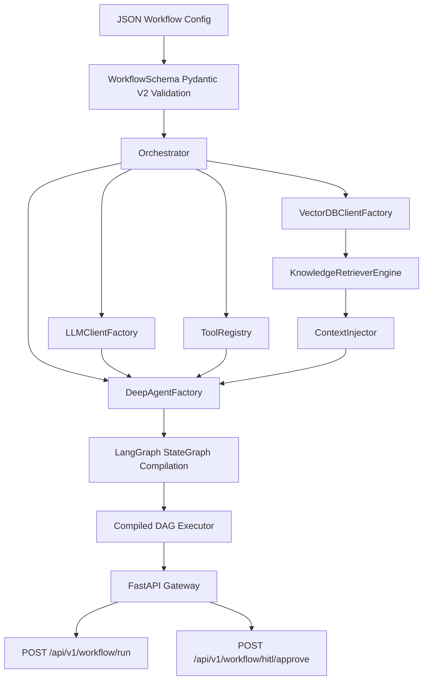

# AgenticAI SDK — Implementation Plan

## Architecture Overview



---

## Package Layout

```
AgenticAI_SDK/
├── pyproject.toml
├── main.py                          # FastAPI entrypoint
├── README.md
├── example_workflow.json            # Sample workflow config
├── agenticai_sdk/
│   ├── __init__.py
│   ├── exceptions.py                # Domain exceptions
│   │
│   ├── schemas/                     # Domain 1: Pydantic V2 models
│   │   ├── __init__.py
│   │   ├── llm.py
│   │   ├── tools.py
│   │   ├── prompts.py
│   │   ├── memory.py
│   │   ├── hitl.py
│   │   ├── rag.py
│   │   ├── topology.py
│   │   ├── agent_node.py
│   │   ├── edges.py
│   │   └── workflow.py              # Root WorkflowSchema
│   │
│   ├── rag/                         # Domain 2: RAG subsystem
│   │   ├── __init__.py
│   │   ├── vector_db_factory.py
│   │   ├── retriever_engine.py
│   │   └── context_injector.py
│   │
│   ├── deep_agent/                  # Domain 3: DeepAgent factory
│   │   ├── __init__.py
│   │   └── factory.py
│   │
│   ├── runtime/                     # Domain 4: Executive runtime
│   │   ├── __init__.py
│   │   ├── llm_factory.py
│   │   ├── tool_registry.py
│   │   ├── context_engine.py
│   │   └── orchestrator.py          # Core macro-execution engine
│   │
│   ├── state/                       # Workflow state definition
│   │   ├── __init__.py
│   │   └── workflow_state.py
│   │
│   └── gateway/                     # Domain 5: FastAPI web server
│       ├── __init__.py
│       ├── middleware.py
│       ├── routes.py
│       └── app.py
```

---

## Domain Breakdown

### Domain 1: Schema & Validation
- All Pydantic V2 `BaseModel` classes with strict field validation
- Custom validators (e.g. prompt template variable matching)
- Enums for all constrained choices

### Domain 2: RAG Subsystem
- Async vector DB client factory (Qdrant, Pinecone, PgVector)
- LangChain `BaseRetriever` wrapper
- Context formatting utilities

### Domain 3: DeepAgent Factory
- `create_deep_agent()` function returning async callable
- Supports model-driven vs agent-driven orchestration modes
- Inner-thought chain logging
- Fallback strategies (retry, escalate, halt)

### Domain 4: Executive Runtime
- `LLMClientFactory` — resolves LLMConfig → ChatModel
- `ToolRegistry` — instantiates tools from ToolConfig
- `ContextEngine` — prompt rendering + memory truncation
- `Orchestrator` — the core engine that compiles WorkflowSchema → LangGraph StateGraph

### Domain 5: FastAPI Gateway
- Execution tracking middleware
- `/workflow/run` endpoint
- `/workflow/hitl/approve` endpoint
- Full async execution

---

## Build Order

| Phase | Files | Description |
|-------|-------|-------------|
| 1 | `pyproject.toml`, `exceptions.py` | Dependencies + custom exceptions |
| 2 | `schemas/*` | All Pydantic V2 models |
| 3 | `state/workflow_state.py` | WorkflowState TypedDict |
| 4 | `rag/*` | RAG subsystem |
| 5 | `runtime/llm_factory.py`, `runtime/tool_registry.py` | Factories |
| 6 | `runtime/context_engine.py` | Context management |
| 7 | `deep_agent/factory.py` | DeepAgent creation |
| 8 | `runtime/orchestrator.py` | Core orchestrator |
| 9 | `gateway/*` | FastAPI gateway |
| 10 | `main.py`, `example_workflow.json` | Entrypoint + sample |

---

> [!IMPORTANT]
> This plan produces ~20 Python files comprising the full SDK. Shall I proceed with generating all files?
